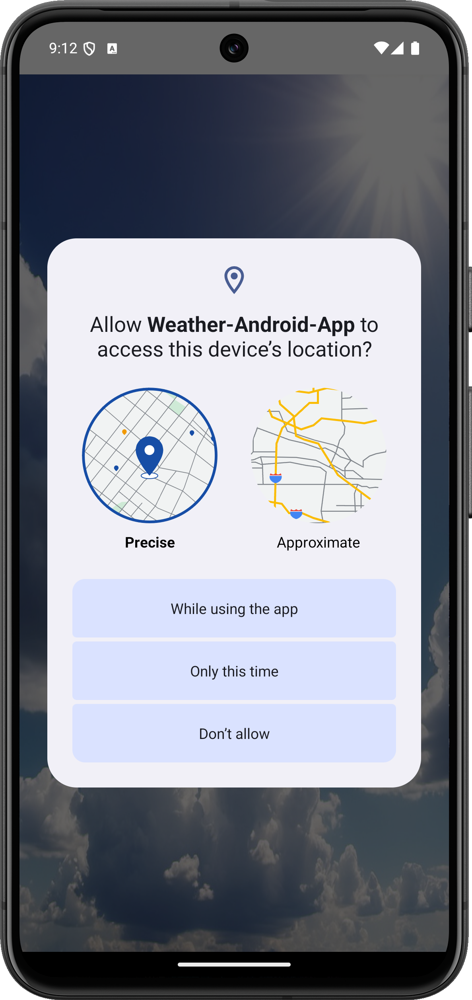
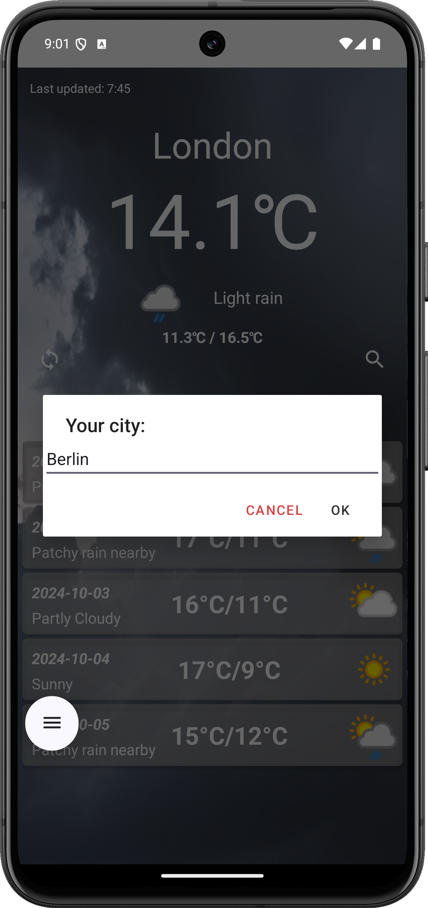

# Weather-Android-App

Kotlin, Android SDK, Volley, LocationManager

_________________________
_________________________

_________________________
_________________________

_________________________
_________________________

_________________________
_________________________

